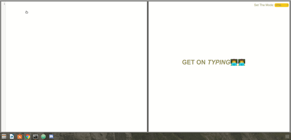
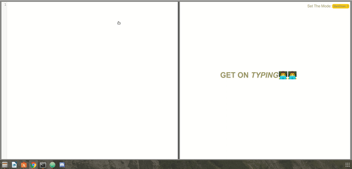

# [__i-edit__](https://omartahoun.github.io/iedit/)
### In the browser text editor that allows the user to write both *(HTML & Markdown)* While having *__Real-Time__*  Preview.

### Built with:
  - [CodeMirror Library](https://codemirror.net)
  - [P5.js](https://p5js.org)

### Examples:

- ### HTML

- ### Markdown

